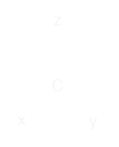

$$
\newcommand{\I}[1]{#1}
\newcommand{\K}[1]{#1}
\newcommand{\A}[1]{\mathbf{#1}}
\newcommand{\scalars}[2][]{\K{#2}\I{#1}}
\newcommand{\versors}[2][]{\A{#2}\I{#1}}
\newcommand{\xs}[1]{\scalars[^{#1}]{x}}
\newcommand{\ys}[1]{\scalars[^{#1}]{y}}
\newcommand{\zs}[1]{\scalars[^{#1}]{z}}
\newcommand{\es}[1]{\versors[_{#1}]{e}}
\newcommand{\fs}[1]{\versors[_{#1}]{f}}
\newcommand{\Xs}[2]{\scalars[_{#1}^{#2}]{X}}
\newcommand{\Ys}[2]{\scalars[_{#1}^{#2}]{Y}}
\newcommand{\Zs}[2]{\scalars[_{#1}^{#2}]{Z}}
\newcommand{\Cs}[3]{\scalars[_{#1#2}^{#3}]{C}}
$$

# Hypercomplex Numbers

Hypercomplex numbers can be considered as a generalization of complex numbers. This website provides some interactive visualizations to build intuition.

In the following we consider numbers of the form:

$$
\A{x} = \xs{\alpha}\es{\alpha} = \sum _{k=0}^{n} \xs{k}\es{k} = \xs{0}\es{0} + \xs{1}\es{1} + \dots + \xs{n}\es{n}
$$

With multiplication determined by structure constants $\Cs{\alpha}{\beta}{\gamma}$:

$$
\es{\alpha}\es{\beta} = \Cs{\alpha}{\beta}{\gamma}\es{\gamma}
$$

The product $\A{z}$ of two hypercomplex numbers $\A{x}$ and $\A{y}$ is given by:

$$
\zs{\gamma}\es{\gamma} = \xs{\alpha}\es{\alpha} \\; \ys{\beta}\es{\beta}= \xs{\alpha}\ys{\beta} \\; \es{\alpha}\es{\beta} = \xs{\alpha}\ys{\beta} \\; \Cs{\alpha}{\beta}{\gamma}\es{\gamma}
$$

Or in string diagram form:

<!--  -->

  

For a detailed discussion of hypercomplex numbers including their algebraic properties, see: [IXEnv](https://ixenv.com/reference/algebra/number-systems/hypercomplex-numbers.html).

For a collection of notable and/or well-known special cases of hypercomplex numbers, see: [AADB](https://filonik.github.io/aadb/).
